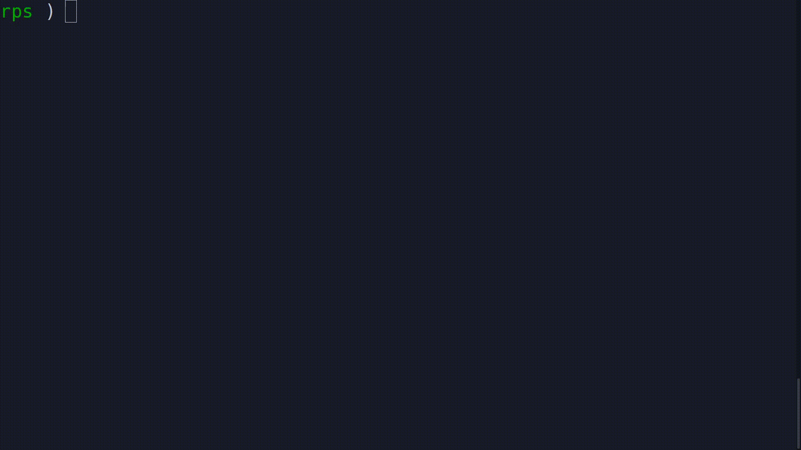

# ROCK-PAPER-SCISSORS

### This Python program allows you to play the classical Rock-Paper-Scissors game but has the ability to read from a save file and update your score.

### As a twist, you can also add or specify your own list such as the one below and the program will automatically calculate which move takes precedence over which.

### Allowed commands:

- !rating - gives you the score
- !exit - exits the program
- custom comma separated moves - customises the game with these moves
- your move

### Here is an example of your conventional game:

### And here is an example of a bit complicated Rock-Paper-Scissors-Lizard-Spock game:

